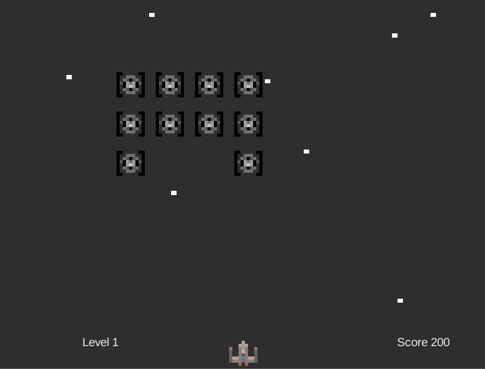

# COMP-2522-202410-Term Project

## Your names:
Yifei Zeng
Cai Chun (Steven) Yan

## Your student numbers:
A01375821
A01381221

## Your GitHub names:
zengyifei327

# Star Wars Game: A Space Shooter with Thoughtful Design Patterns

Star Wars Game is a 2D space shooter built with libGDX, demonstrating effective utilization of object-oriented programming (OOP) principles for creating a well-organized and maintainable codebase.

## Features

- **Engaging Gameplay:** Pilot a spaceship and engage in battles with enemy Tie Fighters, employing strategic bullet firing for victory.
- **Boss Encounter:** Encounter a formidable boss that challenges your skills, adding an extra layer of difficulty.
- **Dynamic Scoring:** Earn points for eliminating enemies, motivating players to conquer successive waves.
- **Intuitive Controls:** Navigate your ship using arrow keys and unleash firepower with the Spacebar.

## Getting Started

1. **Download and Install libGDX:** Obtain the libGDX libraries from the [official website](https://libgdx.com/).
2. **Import Project:** Use your preferred IDE (e.g., Eclipse, IntelliJ IDEA) to import this project.
3. **Verify Dependencies:** Ensure your project is configured with the necessary libGDX dependencies.
4. **Launch the Game:** Run the `DesktopLauncher` class to embark on your spacefaring adventure.

## Controls

- **Movement:** A for Left, D for Right
- **Fire:** Space
- **Exit (EndScreen):** ESC

## Code Structure

The project leverages OOP concepts to structure the code effectively:

- `Main.java`: The game's entry point, responsible for initialization and setting the starting screen.
- `GameScreen.java`: The core gameplay screen where players interact with enemies and manage game state.
- `EndScreen.java`: Displays the final score and provides an exit option after the game concludes.
- `Boss.java` : Manages the boss enemy's behavior, health, and movement.
- `Player.java` : Handles player ship movement, shooting, and damage calculations.
- `TieFighter.java` : Represents the enemy Tie Fighters, including their movement patterns and collision detection.

## Data Structures

- **Arrays, ArrayLists:** These structures likely store collections of enemies (Tie Fighters) within the `GameScreen` or `Boss` classes, enabling efficient management and updates.
- **Bounding Rectangles:** The Rectangle class from libGDX's math package might be used to define collision areas for the player, enemies, and potentially the boss, facilitating collision detection logic.

## Design Patterns

- **Inheritance:** Consider implementing inheritance if different enemy types (regular Tie Fighters vs. boss) share common properties and behaviors. A base `Enemy` class could be created, with `TieFighter` and `Boss` inheriting from it, promoting code reuse and maintainability.
- **Abstraction:** Abstract common functionality like movement, collision detection, and health management into the `Player` and `Enemy` (or a more generic `Entity`) classes, promoting cleaner code by separating core functionalities from specific implementations.
- **Polymorphism:** Employ polymorphism with an abstract method in the `Enemy` class (if implemented) for handling enemy-specific behaviors such as movement patterns and attack styles, allowing for dynamic behavior based on the enemy type at runtime.

## Future Enhancements

Consider adding power-ups, diverse enemy types, background music, sound effects, and a menu system for game modes, difficulty levels, and customization.

